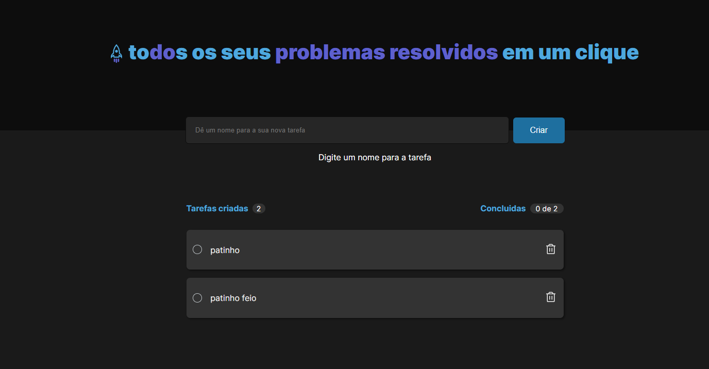
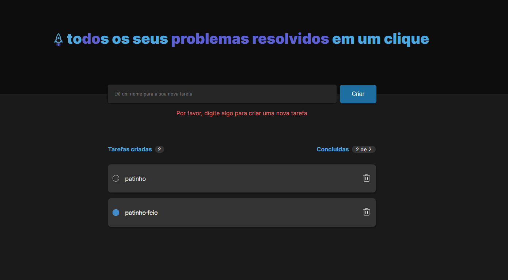

# ToDo List

Esse projeto é um design para um aplicativo de lista de tarefas chamado "ToDo List". O objetivo é fornecer uma interface simples e fácil de usar para os usuários gerenciarem suas tarefas diárias.

## Recursos

O design inclui os seguintes recursos:

- Uma página inicial que exibe uma lista de tarefas e um campo para adicionar novas tarefas.
- As tarefas podem ser marcadas como concluídas ou excluídas.
- As tarefas concluídas podem ser visualizadas ou ocultadas.
- As tarefas podem ser filtradas por data de criação ou data de conclusão.

## Design

O design usa uma paleta de cores em azul e branco para uma aparência limpa e moderna. A tipografia é simples e legível, com fontes sans-serif usadas em todo o aplicativo.

A página inicial exibe uma lista de tarefas com campos para adicionar novas tarefas. As tarefas podem ser marcadas como concluídas ou excluídas clicando nos ícones correspondentes. Os usuários também podem filtrar as tarefas por data de criação ou conclusão, e podem optar por mostrar ou ocultar as tarefas concluídas.

## Conclusão

No geral, o projeto ToDo List tem como objetivo fornecer uma interface simples e fácil de usar para gerenciar tarefas diárias. O design é moderno e elegante, com uma ênfase na funcionalidade e na clareza da informação apresentada. O uso de React, HTML, CSS e TypeScript permite a criação de um aplicativo robusto e escalável.